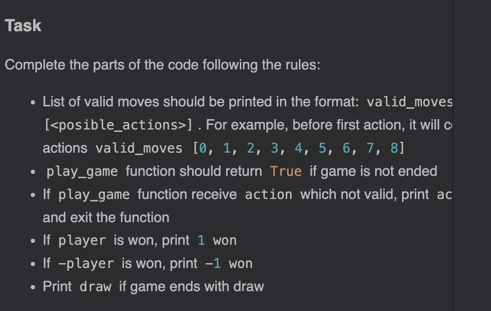

## General

* Extensions' unavailability
A lot of my aquaitances are using some sort of AI assistants (e.g. Copilot). It's a bit frustrating that I can't use them in this course \
p.s.: Well, actually, I can just copy code to VS code and write there=)

* Server disconnects
Sometimes, server disconnects, and I need to launch it again. Not a big deal though.

* Typings
It just makes code more readable and eases the understanding of the statements.


## Problems

### TicTacToe

#### Task Board

* get_valid_moves
Not really clear in what order to flatten the board (row-wise or column-wise). Though, intuitively, it should be row-wise, and it is the case. \
Was I supposed to understand it from `get_player` method?

* get_encoded_state
A bit unclear what is wanted. It'd be nice if an example would be added to the description. \
Also, instead of saying `[i,j] == 1 if in original matrix [i,j] == -1. Zero otherwise.` its better to say `1 if in original matrix [i,j] == BLACK. Zero otherwise.` (here -1 is replaced with BLACK).

It might be useful to add example section for most of the methods that we require to implement in the end of description (in order not to make it too messy).

#### Task Game

* change_perspective

The statement is confusing. Even tests haven't helped much... \
Like, do I need always return a flipped board, or should I do it when I have player equal to -1?

```
For player board should stay the same, but for -player 1 and -1 should be flipped
```
This part is confusing because it's not clear what the authors wanted. \
My first thought is that we need always flip, then I thought that we need to flip only when player is -1.

Recommendation: add more tests

---

Also, it doesn't feel right that Board class is testing in the Game task.

#### Task Round

First of all, GUI issue:

I can't see the whole description (some lines are truncated). It's a bit annoying. \
It's easily solved via expanding the window


I was debugging for a while, because there are strict requirements to the output, but it doesn't really have any practical value. \
Maybe it makes sense to write all output functions at our own?